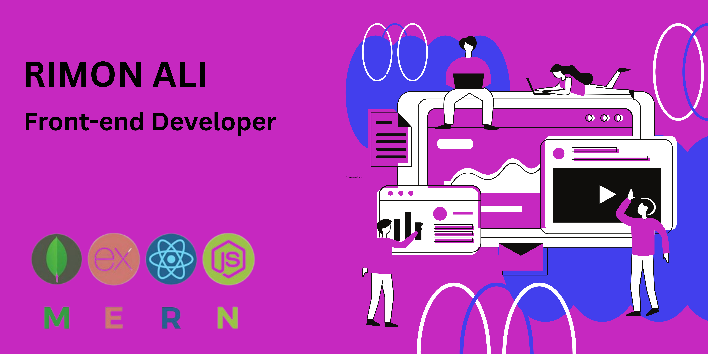

# 💫 About Me:
Hi there! 👋 I’m Rimon Ali, a passionate Web Developer specialized in MERN Stack (MongoDB, Express.js, React, Node.js). I love building scalable web applications, experimenting with new technologies, and solving real-world problems through code.

## 🌐 Socials:
 

# 💻 Tech Stack:
                                               
# 📊 GitHub Stats:
 
 

## 🏆 GitHub Trophies

---

<!-- Proudly created with GPRM ( https://gprm.itsvg.in ) -->
